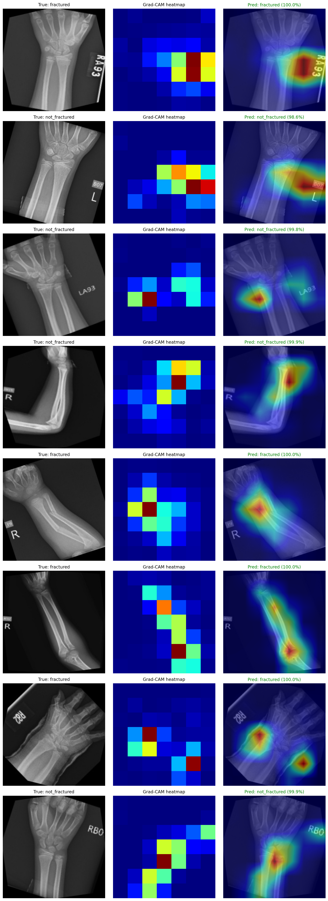

# Bone Fracture Detection with Computer Vision

A deep learning image classifier that detects bone fractures from X-ray images using transfer learning with ResNet-50.

## Results

| Metric | Score |
|--------|-------|
| Test Accuracy | 95.3% |
| Precision (fractured) | 0.97 |
| Recall (fractured) | 0.94 |
| F1-Score | 0.95 |
| Best Val Accuracy | 95.0% |

### Confusion Matrix

|  | Predicted Not Fractured | Predicted Fractured |
|--|------------------------|-------------------|
| **Actual Not Fractured** | 671 | 23 |
| **Actual Fractured** | 44 | 682 |

### Grad-CAM Visualization

The model focuses on bone and joint regions to make predictions, confirming it has learned medically relevant features rather than relying on image artifacts.



## Approach

### Transfer Learning with ResNet-50

Rather than training from scratch on a small medical dataset, this project uses a ResNet-50 backbone pretrained on ImageNet. Training happens in two phases:

1. **Phase 1 — Head training:** Freeze the pretrained backbone, train only the custom classification head (Dropout → Linear → ReLU → Dropout → Linear)
2. **Phase 2 — Fine-tuning:** Unfreeze from layer3 onwards, fine-tune the entire network with differential learning rates (lower for backbone, higher for head)

### Data Pipeline

- **Dataset:** [Kaggle Bone Fracture Dataset](https://www.kaggle.com/datasets/osamajalilhassan/bone-fracture-dataset) (~9,400 X-ray images)
- **Split:** Training and testing sets merged and re-split using stratified sampling (70/15/15) to ensure consistent distribution
- **Augmentation:** Random crop, horizontal/vertical flip, rotation, affine transforms, color jitter, grayscale, Gaussian blur, and random erasing

### Key Design Decisions

- **Merged data splits:** The original train/test split had a distribution mismatch causing poor generalization (64% test accuracy). Merging and re-splitting with stratification resolved this, boosting test accuracy to 95.3%.
- **Two-phase training:** Training the head first prevents destroying pretrained features, then fine-tuning adapts the backbone to X-ray images specifically.
- **Strong augmentation:** Essential for a relatively small medical dataset to prevent overfitting.

## Project Structure

```
├── src/
│   ├── dataset.py      # Dataset class, transforms, data loading
│   ├── model.py        # ResNet-50 architecture with custom head
│   ├── train.py        # Two-phase training loop with early stopping
│   ├── evaluate.py     # Test metrics and classification report
│   └── gradcam.py      # Grad-CAM visualization
├── data/               # Dataset (not tracked in git)
├── checkpoints/        # Saved model weights (not tracked in git)
├── requirements.txt
├── .gitignore
└── README.md
```

## Setup

```bash
# Clone the repo
git clone https://github.com/yourusername/Bone-Fracture-Detection-Computer-Vision.git
cd Bone-Fracture-Detection-Computer-Vision

# Create virtual environment
python -m venv .venv
.venv\Scripts\Activate.ps1  # Windows
# source .venv/bin/activate  # Linux/Mac

# Install dependencies (with CUDA support)
pip install torch torchvision --index-url https://download.pytorch.org/whl/cu126
pip install -r requirements.txt
```

### Download Dataset

Download the [Bone Fracture Dataset](https://www.kaggle.com/datasets/osamajalilhassan/bone-fracture-dataset) from Kaggle and extract it to `data/BoneFractureDataset/`.

## Usage

### Train the model

```bash
python src/train.py
```

Runs both training phases with early stopping. Best model saved to `checkpoints/best_model.pth`.

### Evaluate

```bash
python src/evaluate.py
```

Outputs classification report and confusion matrix on the test set.

### Grad-CAM visualization

```bash
python src/gradcam.py
```

Generates heatmap overlays showing which regions the model focuses on.

## Tech Stack

- **PyTorch** — model and training
- **torchvision** — ResNet-50 pretrained weights and transforms
- **scikit-learn** — stratified splitting and evaluation metrics
- **matplotlib** — visualization and Grad-CAM overlays

## Future Work

- Hyperparameter optimization with Optuna
- K-fold cross-validation for more robust evaluation
- Alternative backbones (EfficientNet, DenseNet)
- Multi-class classification (fracture types)
